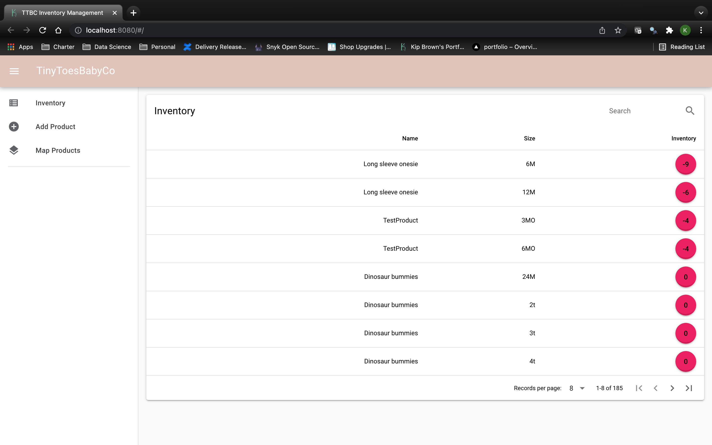
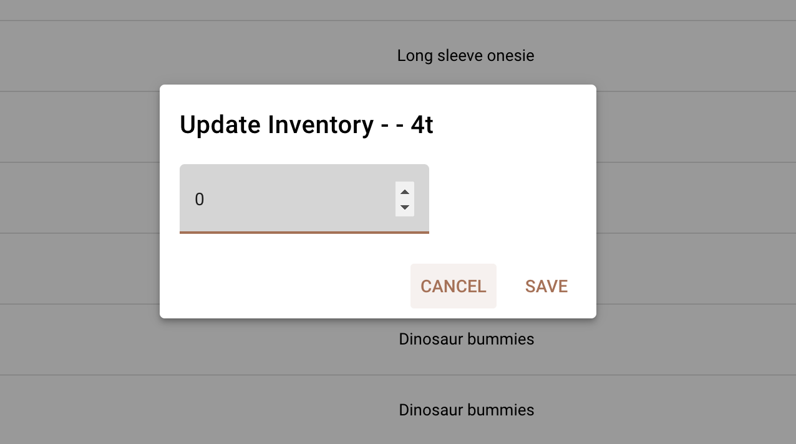
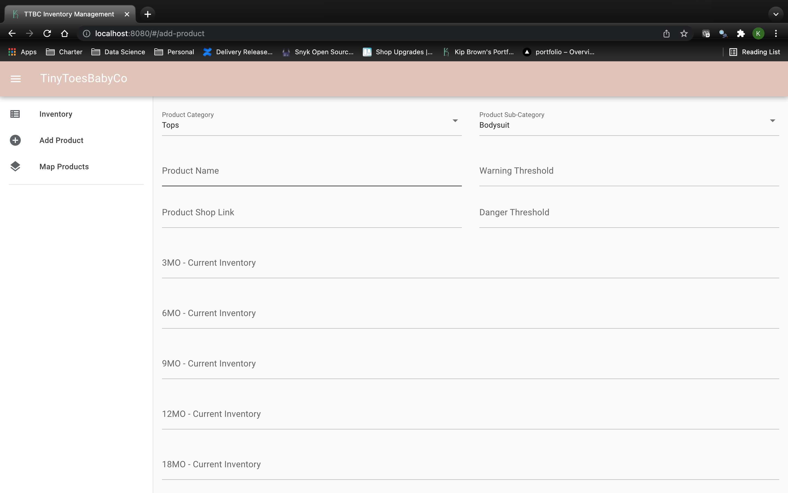

# Overview
Lets start with a little back story.

My wife owns a small business called [TinyToesBabyCo](https://www.etsy.com/shop/TinyToesBabyCo) (TTBC). 
It is a baby & toddler boutique. If you're on the market for some baby clothes, check it out,
I guarantee you'll find something like for your little one.

If you made your way to the shop, you'll have seen that it is on Etsy. For those of you that don't
know, Etsy is a platform for people to sell handmade goods. Overall, Etsy is an awesome platform, 
at least according to my wife. One place that she faces some challenges is in their inventory 
managemnt. It brings enough challenges that she was tracking her inventory by hand in an excel file.
Here are the challenges and what this application aims to accomplish.

1. Etsy's inventory is tracked by listing. TTBC has many listings that contain the same product. A good example of this is a blank onesie. This app solves that problem by taking inventory at the product
level.

2. With all of her manual data entry, her products and listings have a lot of inconsistencies. The
app provides a few forms for more structured data entry. 

3. Instead of manually decreasing her inventory on orders, the app automates it. Using Etsy's developer
API's, the app pulls transactions and decreases the inventory.

4. Estimate time until empty on here inventory based on historic sales patterns (Coming Soon).

5. Product sales dashboard to better understand here size, pattern, and product trends (Coming Soon).

# Usage
As much as I'd like to show you the live running version of the app, I can't (yet). This app currently runs on my raspberry pi's. I'll get around to writing a post on my pi set up. But the point of saying this is that the app is just running on our local network, so screenshots will have to do for now.

## Inventory


First is the inventory page. This page is the bread and butter of the app. Its currently a very simple page. It shows all inventory for the shops products, sorting by the current inventory, and highlighting products with low inventory. My wife requested a simple view of this
information, with a simple way to manually update the inventory from 
this page.

The inventory column is a column of buttons, which in turn pops a modal 
for her to quickly update the inventory. This is mainly just for adding new inventory after she orders new products.



## Add Product


The creation of products is a page for manual data entry. For inventory
to be tracked at the product level, we needed to create these entities.
This page collects this data and performs a bit of validaiton, so she
ends up with cleaner, more consistent data. 

## Etsy Automation
This is where the magic happens. As TTBC has grown, the number of products that are moving every day grows as well. That meant more and more manual inventory upkeep as a part of my wife's daily workflow. All this is done using [Etsy's Developer API](https://www.etsy.com/developers/documentation/getting_started/api_basics). 

The suite of endpoints they offer is pretty extensive, I definitely am not using them to their full potential. Our use case is keeping focuses around listings and transactions, and the API's allow us to pull data on both of those things. 


# Tech Stack

## Python

```python
def hello_world():
  print("Hello World")
```

### FastAPI

### SQLModel

## Javascript

```javascript
console.log("Hello World")
```

### Vue

### Quasar

## Deployment

```sh
docker run hello-world
```